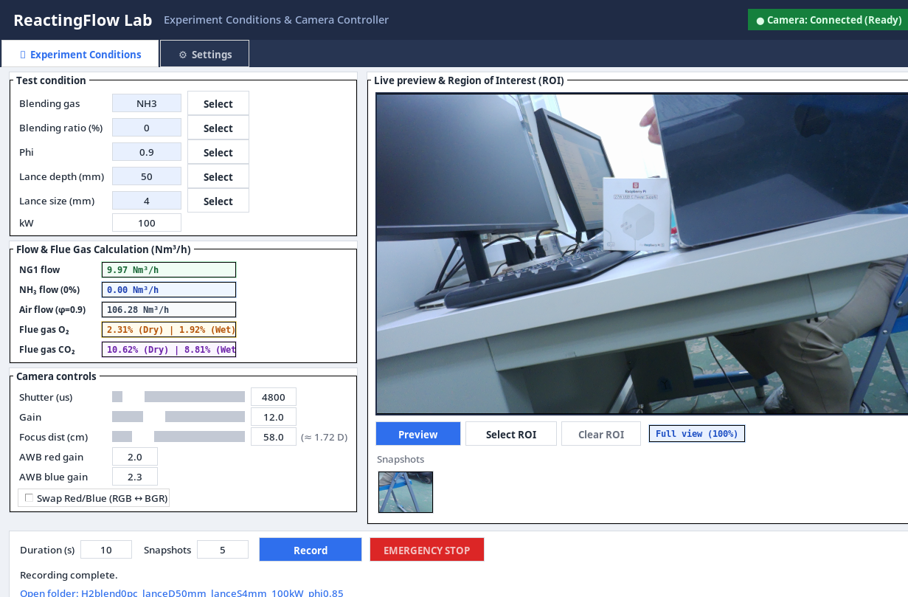
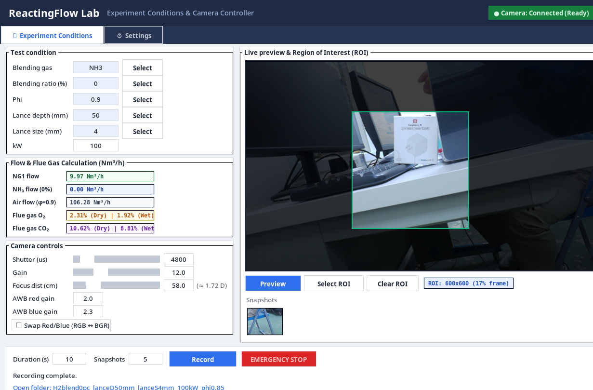
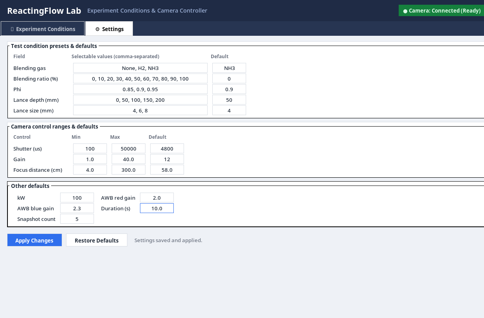

# ReactingFlow Lab - FlameCam 實驗燃燒相機與流量計算控制系統

[](https://github.com/wdhsieh99-mactone/FlameCam)
[](https://www.raspberrypi.com/)
[-purple.svg)](https://www.raspberrypi.com/software/)
[-green.svg)](https://www.raspberrypi.com/documentation/accessories/camera.html)
[](https://www.python.org/)
[](./LICENSE)

**FlameCam** 是由 **ReactingFlow Lab** 開發之專用實驗相機控制與燃燒測試整合平台。系統深度整合樹莓派相機（Raspberry Pi Camera Module 3 / Sony IMX708 光學自動與手動對焦鏡頭），並內建高精度燃燒工程流量計算引擎，可即時推算天然氣（NG1）混氫（$\text{H}_2$）、混氨（$\text{NH}_3$）之燃料流量、空氣需求量以及煙氣乾/濕基之 $\text{O}_2$、$\text{CO}_2$ 濃度，同時提供動態感興趣區域（ROI）即時暗化與自動裁切錄影存檔功能。

---

## 📌 介面展示 (Interface Preview)

### 1. 實驗條件與相機主控制台 (Experiment Conditions Tab)
整合測試條件輸入、燃燒氣體流量與煙氣即時計算面板、相機對焦與曝光參數調節、以及即時畫面預覽。


### 2. 動態 ROI 框選與背景暗化 (Interactive ROI & Dimming)
支援直接在即時預覽畫布上以滑鼠拖曳框選感興趣燃燒火焰區域（ROI），周圍背景立即降低至 25% 亮度，ROI 內部維持 100% 清晰度並標記翡翠綠邊框；後續快照與錄影將自動只裁切並存檔此區域。


### 3. 系統參數與預設值設定頁面 (Settings & Presets Tab)
提供所有燃燒條件下拉選單數值、相機滑桿最小/最大邊界、曝光預設值以及單次記錄時間的靈活配置與即時套用。


---

## 🚀 核心功能與技術特色

### 1. 🔬 燃燒流量與煙氣計算引擎 (Combustion & Flue Gas Calculation)
- **Alicat MFC Nat Gas 1 (NG1) 嚴格成分標準**：
  - 組成基準：$93\%\ \text{CH}_4,\ 3\%\ \text{C}_2\text{H}_6,\ 1\%\ \text{C}_3\text{H}_8,\ 2\%\ \text{N}_2,\ 1\%\ \text{CO}_2$（體積百分比）。
  - 標準低熱值：$\text{LHV}_{\text{NG1}} = 35.892\ \text{MJ/Nm}^3$。
- **多元混燒氣體支援**：
  - 支援 **`None`（純天然氣）**、**`H2`（混氫燃燒）**、**`NH3`（混氨燃燒）**。
  - 支援體積混燒比例 $r_v \in [0, 100]\%$ 精確設定。
- **熱功率輸入守恆（Constant Thermal Input）**：
  - 在維持總熱功率 $kW$（千瓦）不變的條件下，依據混合低熱值自動精準求解天然氣流量與混合氣體流量（$\text{Nm}^3/\text{h}$）。
- **當量比 ($\phi$) 空氣流量計算**：
  - 依據反應式理論化學計量需氧量（$\text{O}_{2,\text{stoich}}$）與空氣含氧比例（$21\%\ \text{O}_2 + 79\%\ \text{N}_2$），依據當量比公式：
    $$\phi = \frac{(\text{Fuel} / \text{Air})}{(\text{Fuel} / \text{Air})_{\text{stoich}}} \implies \dot{V}_{\text{air}} = \frac{\dot{V}_{\text{air,stoich}}}{\phi}$$
    即時計算出實際所需之空氣供應量（$\text{Nm}^3/\text{h}$）。
- **煙氣乾基與濕基即時分析（Dry & Wet Flue Gas Analysis）**：
  - 完整求解燃燒產物（$\text{CO}_2,\ \text{H}_2\text{O},\ \text{N}_2,\ \text{O}_2$ 剩餘量）。
  - 同時提供 **乾基（Dry Basis）** 與 **濕基（Wet Basis）** 之 $\text{O}_2\%$ 與 $\text{CO}_2\%$ 預期濃度，作為煙氣分析儀校正與燃燒效率判定之參考依據。

---

### 2. 🎯 感興趣區域 (ROI) 動態框選與精確裁切 (Region of Interest)
- **直覺式滑鼠拖曳**：在預覽畫布上按住左鍵即可拖曳選取任意大小之燃燒感興趣區域。
- **NumPy 高效能外部暗化（Hardware-accelerated Dimming）**：
  - 透過快速整數位移運算（`arr >> 2`），在 $< 2\text{ ms}$ 內將 ROI 外部區域降低至 25% 亮度，凸顯中心火焰區域。
  - ROI 邊框以鮮明翡翠綠色（#00ff7f）勾勒，並即時顯示所選像素尺寸與畫面佔比（如 `ROI: 600x600 (17% frame)`）。
- **快照自動裁切（Auto-Cropped Snapshots）**：按下拍照鍵時，程式自動將高解析度影像依照選定之 ROI 邊界進行裁切並儲存為獨立 `snapXX.jpg`。
- **錄影自動硬體裁切（Auto-Cropped Video Recording）**：使用高效 FFmpeg 影片管線，在記錄火焰影片時自動擷取 ROI 區域並封裝為 `video.mp4`，大幅節省儲存空間並聚焦燃燒特徵。
- **單鍵還原（Clear ROI / Full view）**：提供重設按鈕隨時一鍵回復 100% 全畫面模式。

---

### 3. 📷 相機光學控制與即時監控 (Camera Optics & Sensor Tuning)
- **鏡頭屈光度物理距離對焦（Lens Focus Mapping）**：
  - Raspberry Pi Camera Module 3 配備音圈馬達（VCM）。底層硬體使用屈光度（Diopters, $D = 1/f$）。
  - 本系統將滑桿映射為直覺的**物理對焦距離（$4.0\text{ cm} \sim 300.0\text{ cm}$）**，並實時顯示對應之鏡頭屈光度數值（如 `58.0 cm (≈ 1.72 D)`），徹底解決非線性與手動對焦反向之困擾。
- **曝光與增益即時調校**：
  - 快門時間：$100\ \mu\text{s} \sim 50,000\ \mu\text{s}$（高動態範圍火焰觀測）。
  - 類比增益：$1.0 \times \sim 40.0 \times$。
- **手動白平衡與色彩通道修正**：
  - 獨立 AWB 紅/藍增益（Red / Blue Gain）調節。
  - **紅白藍色彩互換切換鈕（Swap Red/Blue RGB $\leftrightarrow$ BGR）**：一鍵修正特定驅動或管線下紅色變黑/藍色變橘的通道錯置問題。
- **三重硬體狀態與斷線警示系統**：
  - 頂部狀態徽章：即時顯示 `🟢 Camera: Connected (Ready)` 或 `🔴 Camera: Offline (Error)`。
  - 顯著警告橫幅：相機斷線或驅動異常時自動跳出鮮紅警示列，並提供「重試連線」按鈕。
  - 預覽畫面覆蓋：連線失敗時於預覽畫面中央繪製高對比警示，防止盲拍。

---

### 4. ⚡ 極速零延遲操作架構 (Zero-Lag UI Performance)
- **分頁切換反應時間 $< 1\text{ ms}$**：
  - 採用 Tkinter 底層 `<ButtonPress-1>` 按下即刻觸發事件，淘汰傳統放開後才觸發之延遲。
  - 採用預先建立快取的 Grid 堆疊架構，徹底消除分頁切換時的 UI 重繪卡頓。
- **多執行緒後台非同步架構**：
  - 相機影像擷取、FFmpeg 串流寫入、參數調整命令均由專用 Worker Thread 負責，主 GUI 執行緒永不阻塞，滑鼠操作游標流暢無卡頓。
- **現代化對稱式版面佈局**：
  - 左側控制控制群（測試條件、燃燒計算、相機控制）與右側即時預覽畫布精準維持 603 px 等高視覺平衡。

---

## 📂 專案檔案結構 (Project Structure)

```text
FlameCam/
├── GUI_17.py               # 最新版核心主程式 (建議直接執行此檔)
├── main.py                 # 主程式啟動入口封裝
├── gui12_settings.json     # 系統設定檔 (自動儲存各項預設值與上下限)
├── mediamtx.yml            # RTSP / WebRTC 串流伺服器設定
├── LICENSE                 # MIT 開源授權條款
├── README.md               # 專案中文說明文件
├── c3h8.txt                # 丙烷實驗參數設定模板
├── ch4(0).txt              # 甲烷實驗參數設定模板
├── NH3.txt                 # 氨氣實驗參數設定模板
└── docs/
    └── screenshots/        # 系統截圖展示
        ├── flamecam_main.png
        ├── flamecam_roi.png
        └── flamecam_settings.png
```

---

## 🛠️ 熱力學常數與計算依據 (Thermodynamic Parameters)

本系統依據中華民國標準常態狀態（$0^\circ\text{C},\ 1\ \text{atm}$，即 $\text{Nm}^3$）定義之氣體低熱值（LHV）與完全燃燒反應計量：

| 氣體種類 (Gas) | 分子式 | 低熱值 (LHV, $\text{MJ/Nm}^3$) | 理論需氧量 ($\text{Nm}^3\ \text{O}_2 / \text{Nm}^3\ \text{gas}$) | 理論產水氣量 ($\text{Nm}^3\ \text{H}_2\text{O} / \text{Nm}^3\ \text{gas}$) | 理論二氧化碳量 ($\text{Nm}^3\ \text{CO}_2 / \text{Nm}^3\ \text{gas}$) |
| :--- | :---: | :---: | :---: | :---: | :---: |
| **甲烷 (Methane)** | $\text{CH}_4$ | $35.88$ | $2.0$ | $2.0$ | $1.0$ |
| **乙烷 (Ethane)** | $\text{C}_2\text{H}_6$ | $64.35$ | $3.5$ | $3.0$ | $2.0$ |
| **丙烷 (Propane)** | $\text{C}_3\text{H}_8$ | $93.20$ | $5.0$ | $4.0$ | $3.0$ |
| **氫氣 (Hydrogen)** | $\text{H}_2$ | $10.78$ | $0.5$ | $1.0$ | $0.0$ |
| **氨氣 (Ammonia)** | $\text{NH}_3$ | $14.15$ | $0.75$ | $1.5$ | $0.0$ |
| **天然氣 1 號 (NG1)** | 混和物 | **$35.892$** | **$2.015$** | **$2.000$** | **$1.030$** |

---

## 📦 安裝與環境需求 (Prerequisites & Installation)

### 1. 硬體需求
- **處理器**：Raspberry Pi 4 Model B 或 Raspberry Pi 5
- **相機鏡頭**：Raspberry Pi Camera Module 3 (Sony IMX708, Standard 或 Wide 版本均支援)
- **作業系統**：Raspberry Pi OS (Bookworm, 64-bit 建議)

### 2. 系統相依套件安裝
請在終端機中執行下列指令以安裝所需軟體包：
```bash
sudo apt update
sudo apt install -y python3-pip python3-tk python3-pil python3-numpy ffmpeg wmctrl
```

### 3. 複製儲存庫
```bash
git clone https://github.com/wdhsieh99-mactone/FlameCam.git
cd FlameCam
```

---

## 🖥️ 啟動與使用指南 (Quick Start)

### 啟動應用程式
在終端機中執行以下任一指令即可啟動：
```bash
python3 GUI_17.py
# 或
python3 main.py
```

### 常用操作步驟：
1. **設定燃燒條件**：
   - 於左上方依序選擇 **Blending gas**（None / H2 / NH3）、**Blending ratio (%)**、**Phi ($\phi$)**、**Lance depth**、**Lance size** 與輸入加熱功率 **kW**。
   - 中間的流量計算面板會即時更新天然氣流量、混燒氣體流量、所需空氣流量與煙氣乾/濕基成分。
2. **調整相機光學與焦距**：
   - 拖動 **Focus dist (cm)** 滑桿，依目標火焰物距精準對焦（例如 $50\text{ cm} \sim 80\text{ cm}$）。
   - 調整快門時間與類比增益，若色彩異常可勾選 **Swap Red/Blue**。
3. **選取火焰 ROI**：
   - 點擊 **Select ROI**，在即時預覽畫布上按住滑鼠左鍵並拖曳出火焰區域，周圍背景將自動暗化。
4. **錄影與拍照存檔**：
   - 設定錄影時長（Duration）與快照張數（Snapshots），點擊 **Record** 啟動拍攝。
   - 完成後底部會顯示綠色存檔完成通知與檔案夾開啟超連結，點擊即可直接於檔案總管中檢視裁切後的高解析度火焰影片與照片。

---

## 📄 授權條款 (License)

本專案採用 [MIT License](./LICENSE) 授權條款。

---

## 👥 維護與聯繫 (Authors)
- **開發者**：[ReactingFlow Lab (wdhsieh99-mactone)](https://github.com/wdhsieh99-mactone)
- 如有任何問題或功能建議，歡迎於 [GitHub Issues](https://github.com/wdhsieh99-mactone/FlameCam/issues) 提出！
